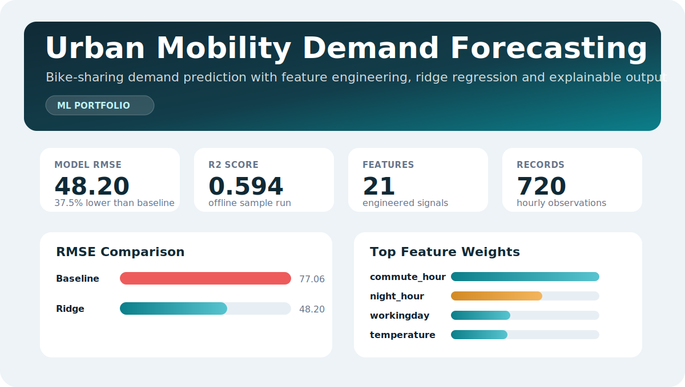

# Urban Mobility Demand Forecasting



**Dashboard:** open `docs/index.html` locally, or enable GitHub Pages from the `docs/` folder to publish it as a project page.

Portfolio project for predicting urban bike-sharing demand from time, weather and seasonality signals.

The project intentionally runs with the Python standard library only, so it can be executed in a fresh virtual environment without downloading packages. It includes:

- data loading with optional UCI Bike Sharing download
- feature engineering for time, weather and seasonal signals
- a baseline model
- a regularized linear regression model implemented from scratch
- evaluation with MAE, RMSE and R2
- explainable feature weights and prediction examples

## Dataset

The project is designed for the public UCI Bike Sharing dataset:

> Fanaee-T, H. (2013). Bike Sharing [Dataset]. UCI Machine Learning Repository. https://doi.org/10.24432/C5W894

If the raw UCI file is not present, the pipeline falls back to a generated sample dataset so the project remains runnable offline.

## Run

```powershell
E:\Data\urban_mobility_forecasting_venv\Scripts\python.exe src\mobility_forecast.py
```

## Test

```powershell
E:\Data\urban_mobility_forecasting_venv\Scripts\python.exe -m unittest discover -s tests
```

## Example Results

Offline sample run:

- Baseline RMSE: 77.06
- Ridge Regression RMSE: 48.20
- R2: 0.594
- Top drivers: commute hour, night hour, working day, temperature and weather condition

